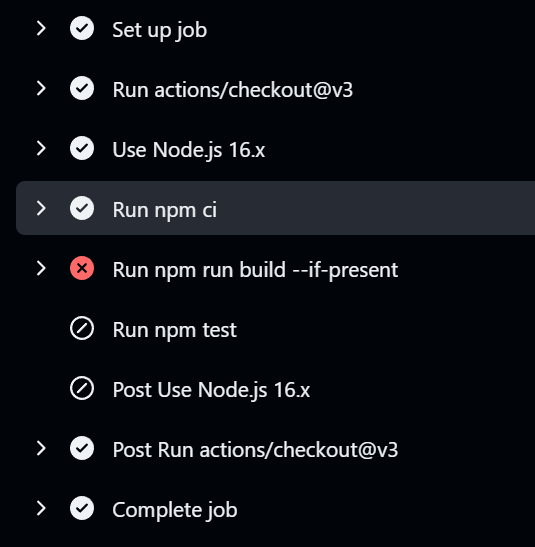
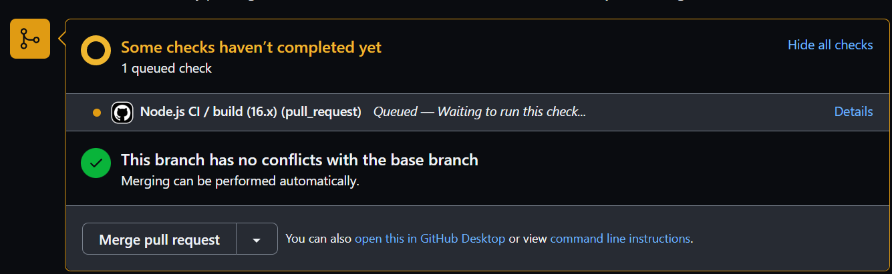
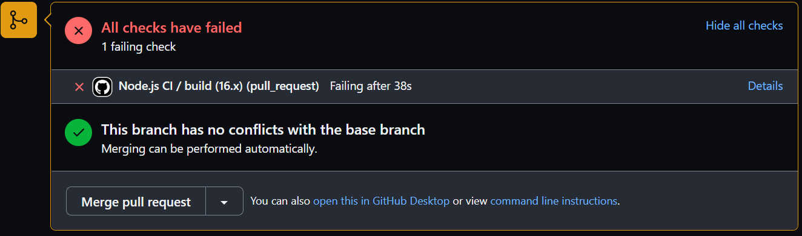
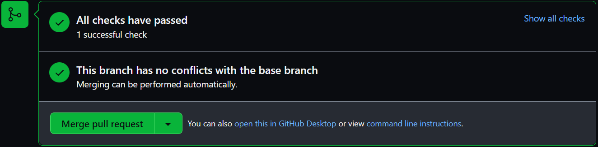
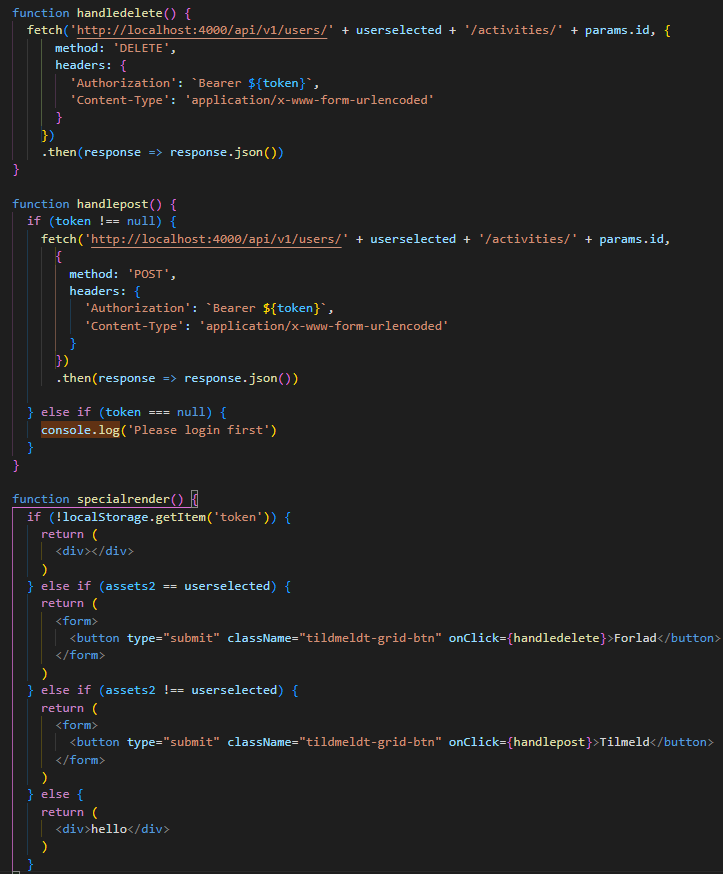
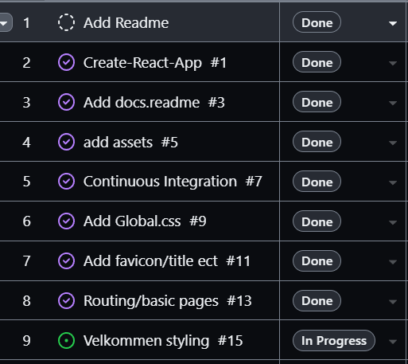
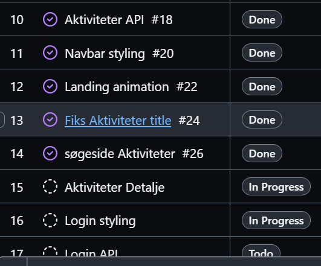
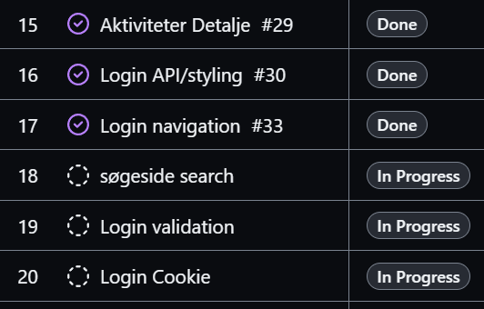
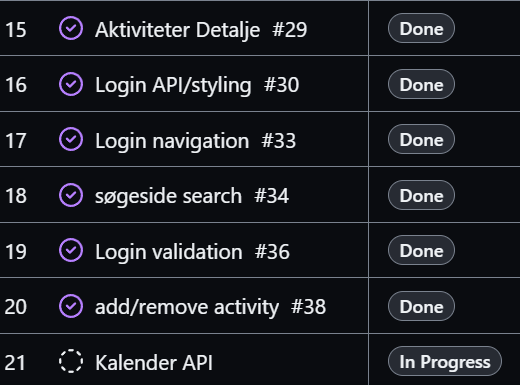

# Dokumentation

## Tech Stack

### Versions styring

- Github

### Grundlæggende

- HTML
- CSS
- JavaScript

### Framework

- React
- npx create-react-app
- react-router-dom

### testing Valgfri opg. B

- Github Actions

## Teck Stack Perspektivering

### Skalering

- Axios i stedet for Fetch api forbereder JSON bedre
- Netlify så man kan se en live version af appen, dette sikrer os at der ikke er ting som kommer til at virke anderledes end hvis man udvikler lokalt.
- "Overveje" AppContext for at undgå at skulle hente localStorage i alle komponenter

### Forbedringer

- Har ikke nået at implementere cookies i stedet for localStorage, da dette var valgfri opgave.
- Kan omdøbe funktioner og placere variabler rigtigt så det er nemmere at læse koden.
- CSS kan omskrives hvis der er tid til det, da det er lidt uoverskueligt.

## Valgfri opgave B

Jeg har løst den valgfrie opgave med Github Actions

Jeg har lavet et workflow, der kører på push til master. Dette workflow kører en test, der tjekker om der er nogle fejl i koden. Hvis der er nogle fejl, vil workflowen fejle. Hvis der ikke er nogle fejl, vil workflowen lykkes.

## Kode eksempel

Jeg vil i min kode komme nærmere ind på dette stykke kode

## Tilgang til opgaven

Jeg har brugt Github projects til opgaven, som er en type Kanban board. Mange af mine opgaver er tilknytttet et Issue eller PullRequest.

### dag 1

### dag 2

### dag 3

### dag 4

### dag 6
