# Dokumentation

## Tech Stack

### Versions styring

- Github

Dette er et godt sted at holde styr på versions historikken. Det er også nemt at dele kode med andre.

### Grundlæggende

- HTML
- CSS
- JavaScript

Basal browser teknologi. HTML og CSS er nødvendige for at kunne lave en hjemmeside. JavaScript er nødvendigt for at kunne lave en dynamisk hjemmeside.

### Framework

- React
- npx create-react-app
- react-router-dom
- Axios

React er et Framework der "streamliner" state management og giver mulighed for at lave dynamiske hjemmesider. npx create-react-app er en kommando der laver en React app. react-router-dom er et package der giver mulighed for at lave en single page application. Axios simplificerer HTTP requests.

### testing (CI) Valgfri opg. B

- Github Actions (se længere nede)

## Teck Stack Perspektivering

### Skalering

- Netlify så man kan se en live version af appen, dette sikrer os at der ikke er ting som kommer til at virke anderledes end hvis man udvikler lokalt.
- "Overveje" AppContext for at undgå at skulle hente data i alle komponenter

### Forbedringer

- Har ikke nået at implementere cookies i stedet for localStorage, da dette var valgfri opgave.
- Kode kan ofte omskrives hvis der er tid til det.

## Valgfri opgave B

Jeg har løst den valgfrie opgave med Github Actions

Jeg har lavet et workflow, der kører på push til master. Dette workflow kører en eslint test, der tjekker om der er nogle fejl i koden. Hvis der er nogle fejl, vil workflowen fejle. Hvis der ikke er nogle fejl, vil workflowen lykkes.

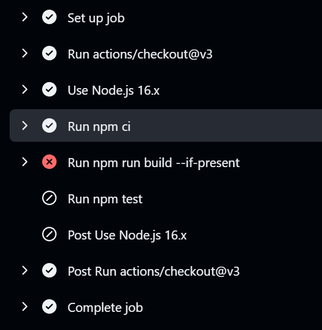
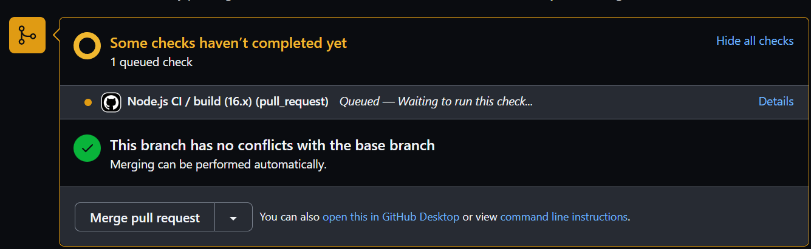
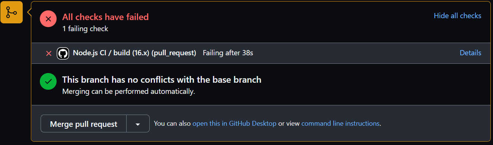
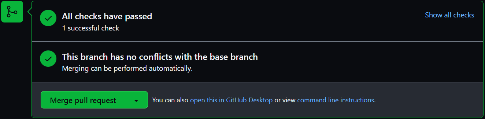

## Kode eksempel

Jeg vil i min kode komme nærmere ind på dette stykke kode

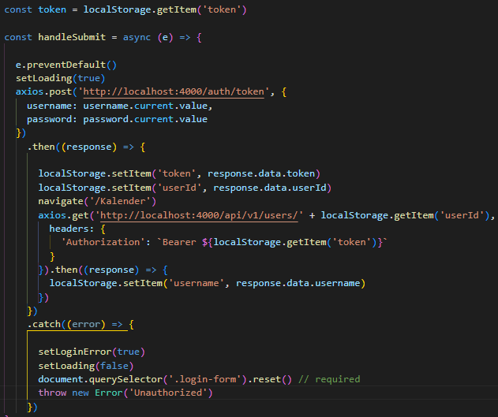

## Tilgang til opgaven

Jeg har brugt Github projects til opgaven, som er en type Kanban board. Mange af mine opgaver er tilknytttet et Issue eller PullRequest.

### dag 1

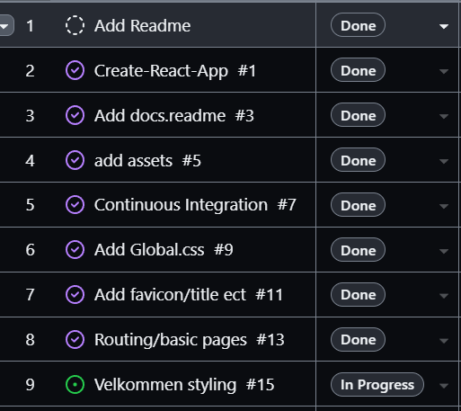

### dag 2

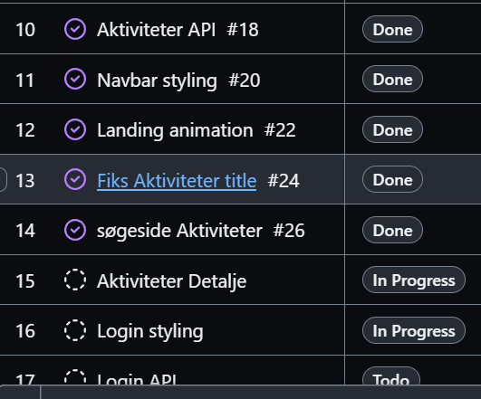

### dag 3

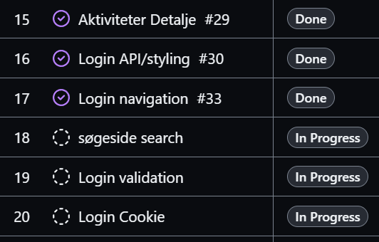

### dag 4

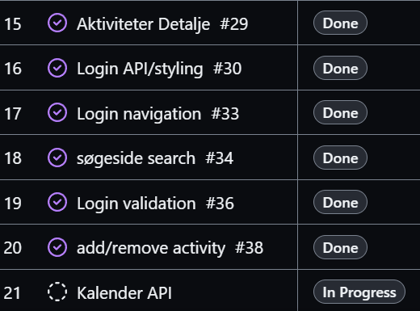

### dag 6

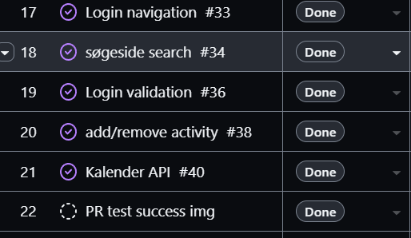

### dag 7

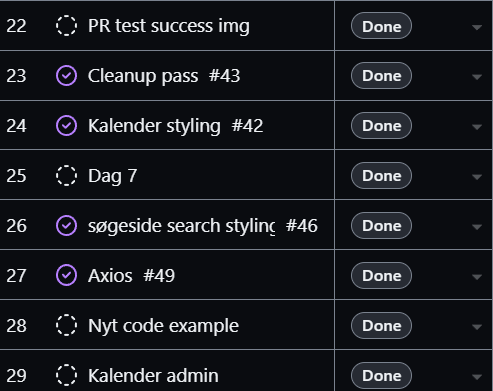